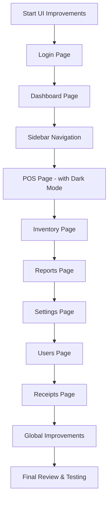

# UI Improvement Plan for Restaurant MVP System

## Overview
This plan outlines comprehensive UI improvements to modernize the entire restaurant MVP system with better design, spacing, visual appeal, and dark mode support for POS and Dashboard pages.

## Current State Analysis
- **Tech Stack**: Next.js, Tailwind CSS, shadcn/ui components
- **Design System**: Basic CSS variables for colors (monochrome with blue accents)
- **Pages**: Login, Dashboard, POS, Inventory, Reports, Settings, Users, Receipts

## Requirements
- Modernize all pages with enhanced design
- Improve spacing and visual appeal
- Add dark mode support for POS and Dashboard pages

---

## Implementation Plan

### 1. Login Page Enhancements
- Modernize branding with improved logo/icon design
- Add subtle gradient background with animation
- Improve form styling with better input focus states
- Add subtle shadow and card effects
- Enhance button hover/active states

### 2. Dashboard Page Enhancements
- **Stat Cards**: Add gradient backgrounds, subtle shadows, hover lift effects
- **Layout**: Improve grid layout for better responsiveness
- **Restaurant Cards**: Enhance with better images, ratings display, action buttons
- Add smooth transitions and micro-interactions

### 3. Sidebar Navigation Enhancements
- Add smooth collapse/expand transitions
- Improve active state styling with background gradients
- Add hover effects with subtle background changes
- Better icon sizing and spacing
- Add tooltips when collapsed

### 4. POS Page Enhancements (with Dark Mode)
- **Dark Mode**: Add full dark mode support with proper contrast
- **Layout**: Improve grid layout for menu items
- **Touch Targets**: Enlarge buttons for tablet use (min 48px)
- **Cards**: Modernize menu item cards with better shadows
- **Order Summary**: Improve visual hierarchy
- Add smooth animations for cart updates

### 5. Inventory Page Enhancements
- Modernize table design with alternating rows
- Improve search and filter UI with better inputs
- Enhance dialog/modals with better transitions
- Add status badges with color coding
- Improve action buttons styling

### 6. Reports Page Enhancements
- Modernize chart containers with better styling
- Improve date range picker design
- Add card-based layout for different report sections
- Enhance data visualization with better colors
- Add print-friendly styles

### 7. Settings Page Enhancements
- Improve tabs navigation with underline indicators
- Better form groupings with card sections
- Enhance toggle switches with better visual feedback
- Add section descriptions
- Improve save/reset button styling

### 8. Users Page Enhancements
- Modernize user table/list design
- Add avatar styling
- Improve action buttons (edit, delete)
- Add role badges with color coding
- Enhance dialog/modals

### 9. Receipts Page Enhancements
- Improve receipt display formatting
- Add print styling
- Enhance action buttons
- Better empty state designs

### 10. Global Improvements
- Add dark mode CSS variables for POS and Dashboard
- Improve typography scale consistency
- Add spacing system improvements
- Add subtle animations and transitions
- Ensure visual consistency across all pages

---

## Mermaid: Implementation Workflow

---

## Priority Order
1. Login & Dashboard (first impressions)
2. Sidebar Navigation (affects all pages)
3. POS Page (core functionality)
4. Other pages (Inventory, Reports, Settings, Users, Receipts)
5. Global refinements

## Notes
- Each page will be enhanced while maintaining functionality
- Dark mode will use CSS variables for easy theming
- Mobile responsiveness will be maintained throughout
- All changes will follow existing shadcn/ui patterns
